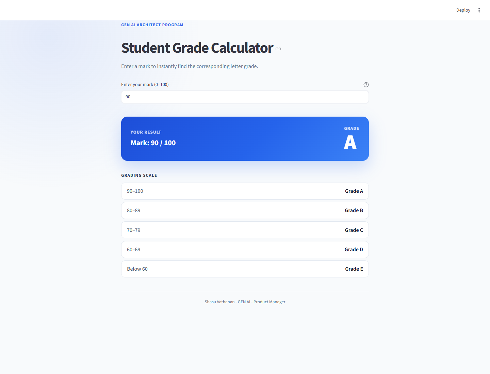

<div align="center">


# Student Grade App

**Shasu Vathanan - GEN AI - Product Manager**

[](https://shasuvathanan.com)
[](https://www.linkedin.com/in/shasuvathanan)

</div>

$\textcolor{#FF4A62}{\rule{26em}{4pt}}$

**A Streamlit web application that converts a student mark from 0 to 100 into a letter grade.**

A **Phase-004-FastAPI-And-Streamlit** build. The full [project brief](./GenAI_Architect_Streamlit_Grade_App_Assignment.pdf) — goal, grading scale, requirements, and deliverables — is included in this folder.

---

## Quick Navigation

| Section | Contents |
| :-- | :-- |
| [Features](#features) | What the app does |
| [Grading scale](#grading-scale) | The exact bands and boundaries |
| [Setup and run](#setup-and-run) | Four commands to a running app |
| [Testing](#suggested-test-marks) | Values that cover every band |
| [Screenshots](#screenshots) | The app running, for three marks |

---

## Features

- Accepts whole-number and decimal marks from 0 to 100
- Calculates grades using exact inclusive boundaries
- Clearly displays both the entered mark and the resulting grade
- Shows friendly messages for empty, non-numeric, and out-of-range input
- Includes a responsive, polished interface and a grading-scale reference

---

## Grading scale

| Mark | Grade |
| :-- | :--: |
| 90–100 | **A** |
| 80–89 | **B** |
| 70–79 | **C** |
| 60–69 | **D** |
| Below 60 | **E** |

> [!IMPORTANT]
> Boundary values are **inclusive**. A mark of exactly 90 receives an A, exactly 80 a B, exactly 70 a C, and exactly 60 a D.

---

## Project structure

```text
.
├── grade_app.py          # Complete application and grading logic
├── requirements.txt      # Python dependencies
├── screenshots/          # The app running, for three marks
│   ├── grade-90-A.png
│   ├── grade-85-B.png
│   └── grade-59-E.png
├── .gitignore
└── README.md
```

All application code and grading logic are contained in a single `grade_app.py`, as the brief requires.

---

## Setup and run

### 1. Create a virtual environment

```powershell
python -m venv venv
```

### 2. Activate it

Windows PowerShell:

```powershell
venv\Scripts\Activate.ps1
```

macOS or Linux:

```bash
source venv/bin/activate
```

### 3. Install dependencies

```powershell
python -m pip install -r requirements.txt
```

### 4. Start the app

```powershell
streamlit run grade_app.py
```

Streamlit opens the application in a browser, normally at `http://localhost:8501`. Press `Ctrl + C` to stop it.

---

## Suggested test marks

These values exercise every band and every boundary:

| Mark | Expected grade |
| --: | :--: |
| 100 | A |
| 90 | A |
| 89 | B |
| 80 | B |
| 70 | C |
| 60 | D |
| 59 | E |
| 0 | E |

---

## Invalid-input handling

An empty field displays a prompt instead of attempting a calculation. Text and other non-numeric input show a friendly validation message. Numbers below 0 or above 100 display a range warning. None of these cases crashes the app — every invalid path ends in a readable message and leaves the user able to try again.

---

## Screenshots

The running app, captured at three different marks:

| Mark | Grade | Screenshot |
| :-- | :--: | :-- |
| 90 | A | [grade-90-A.png](screenshots/grade-90-A.png) |
| 85 | B | [grade-85-B.png](screenshots/grade-85-B.png) |
| 59 | E | [grade-59-E.png](screenshots/grade-59-E.png) |

<div align="center">



</div>

---

## Build checklist

- [x] `grade_app.py` with all logic in a single file
- [x] Screenshots showing at least three different marks
- [x] Invalid-input explanation (included above)
- [x] GitHub repository link

---

## Requirements

- Python 3.9 or newer
- `streamlit`

📄 **Project brief:** [GenAI_Architect_Streamlit_Grade_App_Assignment.pdf](./GenAI_Architect_Streamlit_Grade_App_Assignment.pdf)

$\textcolor{#FF4A62}{\rule{20em}{2pt}}$

## Contributing

Feel free to fork this repository, improve the content, and share your knowledge with the community.

---

<div align="center">

**Created and Maintained by**

### Shasu Vathanan - GEN AI - Product Manager

[SHASUVATHANAN.COM](https://shasuvathanan.com) &nbsp;•&nbsp; [LinkedIn](https://www.linkedin.com/in/shasuvathanan)

</div>
