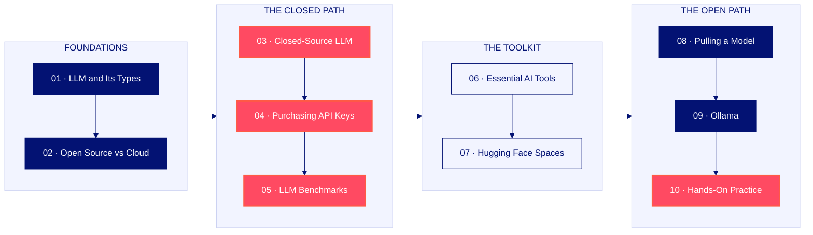

# Phase-005-LLM-Foundations-and-Practical-Tools — LLM Foundations and Practical Tools

**Shasu Vathanan - GEN AI - Product Manager**

$\textcolor{#FF4A62}{\rule{26em}{4pt}}$

**From what the three letters in LLM actually mean, to a model running locally on your own laptop.**

Phase-001-Programming-Foundations to Phase-004-FastAPI-And-Streamlit built the Python, the automation and the interfaces. This phase adds the thing all of it was leading to: **the model itself** — what an LLM is, how it works, how the open and closed families differ, what access costs, how models are measured, and the two practical ways to run one on your own machine.

Ten topics, in order, with a complete written guide and a 102-slide deck.

---

## Quick Navigation

| # | Topic | What it covers |
| :-- | :-- | :-- |
| **01** | [LLM and Its Types](#01--llm-and-its-types) | What the three letters mean, and how a prompt becomes an answer |
| **02** | [Open-Source LLM vs Cloud LLM](#02--open-source-llm-vs-cloud-llm) | Two families of model — and how to read a model card properly |
| **03** | [Closed-Source LLM](#03--closed-source-llm) | The four major players, their platforms, and exactly what you pay |
| **04** | [How to Purchase API Keys for Closed LLMs](#04--how-to-purchase-api-keys-for-closed-llms) | One key, ten dollars, and the setting that stops it running away |
| **05** | [LLM Benchmarks](#05--llm-benchmarks) | How models are measured, and how to turn a score into a decision |
| **06** | [Essential AI Tools](#06--essential-ai-tools) | Three categories of tool, and the small free set actually used |
| **07** | [Hugging Face Spaces](#07--hugging-face-spaces) | The AI world's social platform, and the free apps running inside it |
| **08** | [Pulling an Open-Source Model from Hugging Face](#08--pulling-an-open-source-model-from-hugging-face) | Method one — pull a model with Python and run it on your machine |
| **09** | [Running an Open-Source Model Using Ollama](#09--running-an-open-source-model-using-ollama) | Method two — install, pull, run. The easiest local path there is |
| **10** | [Open-Source Model with Ollama — Hands-On Practice](#10--open-source-model-with-ollama--hands-on-practice) | Install, pull Qwen2.5 0.5B, chat with it, and capture the proof |

---

## What is in this phase

| File | What it is |
| :-- | :-- |
| [**LLM-Foundations-and-Practical-Tools.pdf**](./LLM-Foundations-and-Practical-Tools.pdf) | The complete written guide — all ten topics, with the commands, prices, limits and checklists |
| [**LLM-Foundations-and-Practical-Tools.pptx**](./LLM-Foundations-and-Practical-Tools.pptx) | The 102-slide visual walkthrough of the same ten topics, in the same order |
| [**opensource.py**](./opensource.py) | The Topic 8 run script — loads a local Hugging Face model and chats with it from the terminal |
| [**requirements.txt**](./requirements.txt) | The pinned Python environment used across this phase |

> [!NOTE]
> The PDF, the PowerPoint and this README use the **same topic names, the same sub-topic numbers and the same order**. Read whichever suits you — none of them contradicts the others.

---

## Learning Path



The ten topics group into **four themes**. Each theme answers one question, and together they take you from not knowing what an LLM is to having one running on your own machine.

| Theme | Topics | The question it answers |
| :-- | :-- | :-- |
| **Foundations** | 01 – 02 | What *is* an LLM, and what are the two families? |
| **The closed path** | 03 – 05 | How do I buy access, and how do I choose a model? |
| **The toolkit** | 06 – 07 | What do I install, and what is already free? |
| **The open path** | 08 – 10 | How do I run a model myself? |

$\textcolor{#FF4A62}{\rule{20em}{2pt}}$

# The Ten Topics

---

## 01 · LLM and Its Types

Start with the fundamentals. Once you understand how an LLM works, every term that follows has somewhere to land.

| # | Sub-topic | What it covers |
| :-- | :-- | :-- |
| 1.1 | Breaking down the three letters | **Large** + **Language** + **Model**, decoded |
| 1.2 | How an LLM actually works | The five-step input-to-output journey |
| 1.3 | What exactly is a token | How your sentence is cut into billable units |
| 1.4 | Embeddings | Turning meaning into mathematics |
| 1.5 | Attention, prediction and decoding | Why answers arrive word by word |
| 1.6 | The model family tree | LLM · LMM · SLM · VLM |

**The five steps, every time:**

```
Input  →  Encoder / tokens  →  Embeddings  →  LLM  →  Decoder / output
```

**The model family:**

| Type | Name | What it handles | Typical home |
| :-- | :-- | :-- | :-- |
| **LLM** | Large Language Model | Large-data text work | Industry and enterprise deployments |
| **LMM** | Large Multimodal Model | Text, image, audio and video together | Gemini, ChatGPT |
| **SLM** | Small Language Model | Smaller data, lighter footprint | Your own machine |
| **VLM** | Vision Language Model | Object detection and video analysis | Camera and vision use cases |

> [!TIP]
> A **token** is roughly every word before a space, with special characters counted separately. It is the unit you are billed on — so a tight prompt is a cheaper prompt.

---

## 02 · Open-Source LLM vs Cloud LLM

Understand this one distinction and a great deal of the confusion around LLMs simply disappears.

| # | Sub-topic | What it covers |
| :-- | :-- | :-- |
| 2.1 | The two families | Open source vs closed source |
| 2.2 | Full comparison | Access, cost, control and privacy |
| 2.3 | Where to find them | Ollama and Hugging Face |
| 2.4 | The closed-source players | Four companies leading the race |
| 2.5 | Reading a model card | Capabilities, usage, context, size |
| 2.6 | Your task | Decode one open-source model end to end |

| | **Open-source LLM** | **Cloud / closed LLM** |
| :-- | :-- | :-- |
| **Access** | Model files are downloaded to you | Usage rights only, through the provider |
| **Deployment** | Your laptop, your server, your VM | The provider's cloud infrastructure |
| **Cost** | No API cost once downloaded | Pay per million input and output tokens |
| **Customisation** | Free to modify and adapt | No changes possible on your side |
| **Privacy** | Data stays on the machine you control | Requests travel to the provider |
| **Infrastructure** | Your RAM and GPU decide speed | Provider-scale hardware, nothing to manage |

**Reading a model card — the four things to record:**

1. **Capabilities** — vision, tools, thinking
2. **Usage** — what the model is actually built for
3. **Context window** — how much input it can take in at once, in tokens
4. **Size** — parameter count, and the download size on disk

> [!IMPORTANT]
> **Context window** is how much *input* the model can accept — not how clever it is. Picture a house with one small door: a very large almirah simply will not go through it. Parameters are the separate measure.

**Task:** pick one open-source model, record all four items plus the input types it accepts, and write it up.

---

## 03 · Closed-Source LLM

You never touch the model. You touch an API — and understanding that ecosystem is what makes you effective with it.

| # | Sub-topic | What it covers |
| :-- | :-- | :-- |
| 3.1 | The ecosystem | How a request actually travels |
| 3.2 | The players | Four companies and their founders |
| 3.3 | Inside a platform | Walking the OpenAI docs |
| 3.4 | Frontier vs specialised | Two different jobs |
| 3.5 | Pricing | Input tokens vs output tokens |
| 3.6 | Limits | Context, max output, knowledge cutoff |
| 3.7 | Other consoles | Anthropic · xAI · Google · Moonshot |
| 3.8 | Your task | Decode five closed models |

**How a request travels:**

```
You / your app  →  API key  →  Cloud provider  →  Proprietary model  →  Response
```

**The three limits that decide whether a model fits:**

| Limit | Typical value | What it means |
| :-- | :-- | :-- |
| **Context window** | 400K – 1M tokens | How much input the model can take in |
| **Max output tokens** | 128K | The ceiling on a single generation |
| **Knowledge cutoff** | A fixed date | Nothing after that date is known |

> [!WARNING]
> **Input is where the volume goes, output is where the price is.** On a flagship model, input runs around **$5 per million tokens** and output around **$30 per million**. Keep prompts tight and use the smallest model that works.

**Task:** pick five closed models across the major providers and record capabilities, context window, max output and cost in one sheet.

---

## 04 · How to Purchase API Keys for Closed LLMs

A short, practical topic with one clear instruction and one very important warning.

| # | Sub-topic | What it covers |
| :-- | :-- | :-- |
| 4.1 | Buy one key, only one | Compatibility beats variety |
| 4.2 | The $10 rule | Budget and model discipline |
| 4.3 | The purchase flow | Billing to secret key, step by step |
| 4.4 | Payment cards | What works and what gets blocked |
| 4.5 | The $250 lesson | Why auto top-up must be off |
| 4.6 | Key safety | Handling the secret you just created |
| 4.7 | What you can build | What the key unlocks |
| 4.8 | Your checklist | Before you move on |

**The purchase flow:**

1. Open `platform.openai.com` and sign in
2. Search **billing** → **Add credits**
3. Add a payment method
4. Add **$10** in credits — no more while learning
5. **Disable auto top-up / auto renewal**, and confirm it is off
6. **API keys** → **Create new secret key**, named clearly
7. Copy and store the key safely

> [!WARNING]
> **The $250 lesson.** Auto-renewal left on while a process looped kept topping up and kept spending for two days. A runaway loop with auto top-up enabled has no ceiling; without it, the credit runs out and the spend simply stops. **Turn it off, and verify it is off before you leave the page.**

**Key safety:**

- [ ] Name the key clearly, so you know what it is for
- [ ] Copy it at creation time — the full secret is shown once
- [ ] Keep it out of your code and out of screenshots
- [ ] One key per purpose, so a single key can be revoked
- [ ] Revoke anything exposed and create a new one

---

## 05 · LLM Benchmarks

Reading benchmarks is a skill. Build it once and every future model release becomes easy to judge.

| # | Sub-topic | What it covers |
| :-- | :-- | :-- |
| 5.1 | Why benchmarks matter | Matching model to use case |
| 5.2 | Where to find them | Release pages and release notes |
| 5.3 | Reading a scorecard | A worked example |
| 5.4 | The benchmark families | What each one measures |
| 5.5 | Aggregate indexes | One profile, several axes |
| 5.6 | Benchmark to use case | Turning scores into decisions |

| Family | What it measures |
| :-- | :-- |
| **SWE-bench** | Software engineering — every skill a developer needs, tested |
| **Humanity's Last Exam** | Multi-discipline reasoning at the very hardest level |
| **GDPval** | Knowledge work — real economic tasks, scored into one number |
| **Domain benchmarks** | Financial analysis and other sector-specific tests |

**Turning a benchmark into a decision:**

| If your job is… | Look at… |
| :-- | :-- |
| Writing and fixing code | SWE-bench and the coding index |
| Generating images | The specialised image model line-up |
| Hard multi-step reasoning | Humanity's Last Exam, the agentic index |
| Everyday, high-volume work | Cost per million tokens plus latency |

> [!TIP]
> A model is released today — read its benchmarks today. That single habit keeps you current for the rest of your career. Then always validate on your own real use case before you commit.

---

## 06 · Essential AI Tools

The rule for this phase is simple: **do not spend money learning Gen AI tools.**

| # | Sub-topic | What it covers |
| :-- | :-- | :-- |
| 6.1 | The zero-spend rule | No money on tools while learning |
| 6.2 | The tool ecosystem | Three categories, mapped |
| 6.3 | Gen AI chat tools | The four actually used |
| 6.4 | AI code editors | Desktop and web |
| 6.5 | Agentic tools | What they are, and why later |
| 6.6 | Assisted vs agentic | The distinction that matters |
| 6.7 | Your stack | What you install today |
| 6.8 | Your checklist | Before you move on |

| Category | What it is for | Examples |
| :-- | :-- | :-- |
| **Gen AI chat tools** | Your daily assistant | ChatGPT · Gemini · Kimi · Qwen · DeepSeek · Claude · Grok |
| **AI code editors** | Where you build | Desktop: Antigravity · Cursor · Replit · Kiro · GitHub Copilot. Web: Lovable · Bolt · Emergent · Base44 |
| **Agentic tools** | Autonomous task execution | Prompt in, work done — covered in a later phase |

**The stack for this phase:**

| Tool | Why it is on the list |
| :-- | :-- |
| **VS Code** | Everything is built here |
| **Four free chat tools** | ChatGPT, Gemini, Kimi and Qwen — completely free |
| **OpenAI API key** | The $10 key from Topic 4, on mini or nano models |
| **Nothing else, for now** | Cursor and Antigravity are optional |

> [!NOTE]
> **AI-assisted** means you use AI to help you finish a task and stay in the loop. **Agentic** means you give a prompt and the tool does the work itself. This phase is firmly on the assisted side.

---

## 07 · Hugging Face Spaces

Someone has already built the thing you need, published it free, and left it running in your browser.

| # | Sub-topic | What it covers |
| :-- | :-- | :-- |
| 7.1 | What Hugging Face is | Social media for AI developers |
| 7.2 | The site map | Models, Datasets, Spaces and more |
| 7.3 | What Spaces are | Working apps, built by the community |
| 7.4 | How a Space works | Model → app → interface → you |
| 7.5 | Categories | What you will find inside |
| 7.6 | A live walkthrough | Image generation, end to end |
| 7.7 | High-value Spaces | OCR and image upscaling |
| 7.8 | Your action | Explore and shortlist |

**How a Space works:**

```
Open-source model  →  Space / application  →  Gradio or Streamlit  →  Your browser  →  Output
```

| Section | What it holds |
| :-- | :-- |
| **Models** | The open model catalogue — details, files and versions, filter by size |
| **Datasets** | Public training and evaluation data, paired with the models |
| **Spaces** | Live demo apps built by the community, running in your browser |
| **More** | Docs, enterprise plans and pricing |

> [!TIP]
> The two Spaces worth knowing first: **OCR**, which pulls content out of a PDF and hands it back as clean Markdown, and **image upscaling**, which restores degraded photographs. Both are free and both are genuinely useful day to day.

**Action:** browse Spaces, run image generation, OCR and upscaling once each, and shortlist the ones that fit your work.

---

## 08 · Pulling an Open-Source Model from Hugging Face

A genuine skill worth having — and one that demands respect for your machine's limits. This is **method one** of two.

| # | Sub-topic | What it covers |
| :-- | :-- | :-- |
| 8.1 | The reality check | Model sizes and machine limits |
| 8.2 | Two methods | Where this one fits |
| 8.3 | The full flow | Hub to local conversation |
| 8.4 | Project setup | VS Code, venv, packages |
| 8.5 | Account and login | Creating and verifying your account |
| 8.6 | Pulling the model | The download command |
| 8.7 | The run script | Loading, tokenising, generating |
| 8.8 | Making it interactive | Real-time input and a UI |

> [!WARNING]
> Most open models are **2–10 GB**, and **16 GB+ of RAM** plus a good GPU is the comfortable baseline. Running a large model on a low-spec laptop is a real risk of freezing or damaging the machine. Learn the method — then choose the machine carefully.

**Project setup:**

```bash
python -m venv venv
venv\Scripts\activate
pip install transformers torch huggingface_hub
```

**Pull the model:**

```bash
hf download Qwen/Qwen2.5-0.5B-Instruct --local-dir ./models/qwen-0.5b
```

**Run it** — the full script is in [`opensource.py`](./opensource.py):

```python
from transformers import AutoTokenizer, AutoModelForCausalLM

MODEL_PATH = "./models/qwen-0.5b"

tokenizer = AutoTokenizer.from_pretrained(MODEL_PATH)
model = AutoModelForCausalLM.from_pretrained(
    MODEL_PATH, torch_dtype="auto", device_map="cpu")
```

**Sizing guide:** TinyLlama 1.1B needs roughly 4–6 GB RAM. Qwen2.5 0.5B needs roughly 2–4 GB, and the model file itself is only around 500 MB.

---

## 09 · Running an Open-Source Model Using Ollama

One command to pull, one command to run. This is **method two** — and the one you will actually reach for.

| # | Sub-topic | What it covers |
| :-- | :-- | :-- |
| 9.1 | What Ollama is | The easiest way to run open models |
| 9.2 | Install and verify | Download, install, check version |
| 9.3 | The model library | Local models vs cloud models |
| 9.4 | The commands | Four you will use constantly |
| 9.5 | A live run | Pull and chat with a 400 MB model |
| 9.6 | App vs command line | Why the CLI wins |
| 9.7 | Size vs quality | The honest trade-off |
| 9.8 | Into your application | And the production warning |

**The four commands:**

```bash
# 1. Confirm Ollama is installed
ollama --version

# 2. Run a model (pulls it automatically the first time)
ollama run qwen2.5:0.5b

# 3. Chat with it
>>> Generate an email for applying for an AI engineer role

# 4. Run it again later — no re-download
ollama run qwen2.5:0.5b
```

**Method 1 vs Method 2:**

| | **Hugging Face + Python** (Topic 8) | **Ollama** (Topic 9) |
| :-- | :-- | :-- |
| **Setup** | venv, packages, account, login, download | Install the app, then one command |
| **Code** | You write the loader and generation script | None required to start chatting |
| **Control** | Full control over tokeniser and generation | Sensible defaults handled for you |
| **Model files** | You manage the folders yourself | Pulled and cached automatically |
| **Best for** | VMs and servers, understanding the internals | Getting a model running quickly |

> [!WARNING]
> **Do not use a locally-run model as the backend of a production app.** It takes a long time to respond, and the user gets frustrated. Always use an API in production — know this exists, but do not ship it.

---

## 10 · Open-Source Model with Ollama — Hands-On Practice

The concept becomes real the moment you run it yourself. Complete this without skipping it.

| # | Sub-topic | What it covers |
| :-- | :-- | :-- |
| 10.1 | Your hands-on task | The task, stated precisely |
| 10.2 | The workflow | Five steps to complete it |
| 10.3 | Deliverables and validation | What done looks like |
| 10.4 | Common problems | And what to do about each |
| 10.5 | Everything to complete | The full phase checklist |
| 10.6 | Phase-005 in one picture | Ten topics, four themes |

**The task:** install Ollama, pull **Qwen2.5 0.5B** (around 400 MB), give it an input, take an output, and capture two screenshots.

**Definition of done:**

- [ ] **Ollama installed** — verified with `ollama --version`
- [ ] **Model pulled** — `qwen2.5:0.5b`, roughly 400 MB, downloaded successfully
- [ ] **Screenshot 1 — the pull** — the model being pulled, showing success
- [ ] **Screenshot 2 — the chat** — your input and the model's response, visible together

**Common problems:**

| Symptom | Cause | What to do |
| :-- | :-- | :-- |
| The laptop stalls | The model is too large for available memory | Stay on the 0.5B model |
| Download incomplete | The pull was interrupted | Let it finish fully before running the model |
| Command not found | Ollama has not finished installing | Check `ollama --version` |
| Weak output | Expected on a 0.5B model | Quality follows size — try Gemma 2 if RAM allows |

$\textcolor{#FF4A62}{\rule{20em}{2pt}}$

## Everything to complete in this phase

- [ ] **Decode one open-source model** — capabilities, usage, context window, size — *Topic 2*
- [ ] **Decode five closed-source models** — capabilities, context, output, cost — *Topic 3*
- [ ] **Purchase the OpenAI API key** — $10 in credits, auto top-up disabled — *Topic 4*
- [ ] **Explore Hugging Face Spaces** — image generation, OCR and upscaling — *Topic 7*
- [ ] **Run a model with Ollama** — install, pull, chat — *Topics 9 and 10*
- [ ] **Capture the two screenshots** — the pull and the conversation — *Topic 10*

---

## Where you stand at the end of this phase

| | What you can do |
| :-- | :-- |
| **Understand** | Tokens, embeddings, attention, and the four model families |
| **Choose** | Open source or closed source, judged on benchmarks and on cost |
| **Build** | An API key in hand, free tools installed, and a local model running |

---

## Conventions used throughout

| Element | Meaning |
| :-- | :-- |
| `> [!NOTE]` | Context worth knowing |
| `> [!TIP]` | A shortcut or a better way |
| `> [!IMPORTANT]` | Do not skip this |
| `> [!WARNING]` | This one costs money or breaks things |
| `- [ ]` | A task you are expected to complete |

**Brand palette** — Coral Red `#FF4A62 → #FF5A45` for highlights and accents, Deep Blue `#031273` for structure, headings and diagrams. Black is never used as a design colour.

---

## Phase map

| Phase | Focus | Document |
| :-- | :-- | :-- |
| [Phase-001-Programming-Foundations](../Phase-001-Programming-Foundations/) | Python fundamentals — the Student Grade System in a terminal | [📄 PDF](../Phase-001-Programming-Foundations/Student%20Grade%20System.pdf) |
| [Phase-002-GenAI-Python-Toolkit](../Phase-002-GenAI-Python-Toolkit/) | Mandatory Python concepts for Generative AI | [📄 PDF](../Phase-002-GenAI-Python-Toolkit/Mandatory%20Python%20Concepts%20for%20Generative%20AI.pdf) |
| [Phase-003-Robotic-Process-Automation-(RPA)](../Phase-003-Robotic-Process-Automation-%28RPA%29/) | RPA — desktop and browser automation | [📄 PDF](../Phase-003-Robotic-Process-Automation-%28RPA%29/RPA%20-%20Robotic%20Process%20Automation.pdf) |
| [Phase-004-FastAPI-And-Streamlit](../Phase-004-FastAPI-And-Streamlit/) | Interfaces and APIs — Streamlit and FastAPI | [📄 PDFs](../Phase-004-FastAPI-And-Streamlit/) |
| **Phase-005-LLM-Foundations-and-Practical-Tools** | **LLM foundations and practical tools — open models, closed models and local inference** | *this phase* |

$\textcolor{#FF4A62}{\rule{20em}{2pt}}$

## Contributing

Feel free to fork this repository, improve the content, and share your knowledge with the community.

---

**Created and Maintained by:**

### **Shasu Vathanan - GEN AI - Product Manager**

<a href="https://shasuvathanan.com" target="_blank">SHASUVATHANAN.COM</a> &nbsp;&#8226;&nbsp; <a href="https://www.linkedin.com/in/shasuvathanan" target="_blank">LinkedIn</a>
